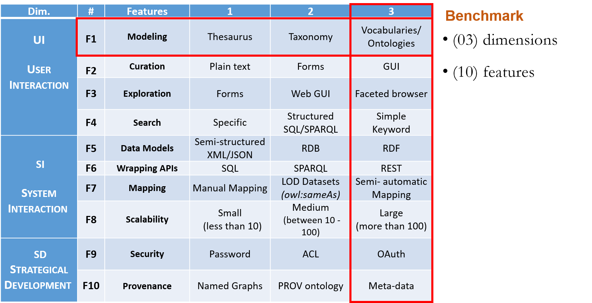
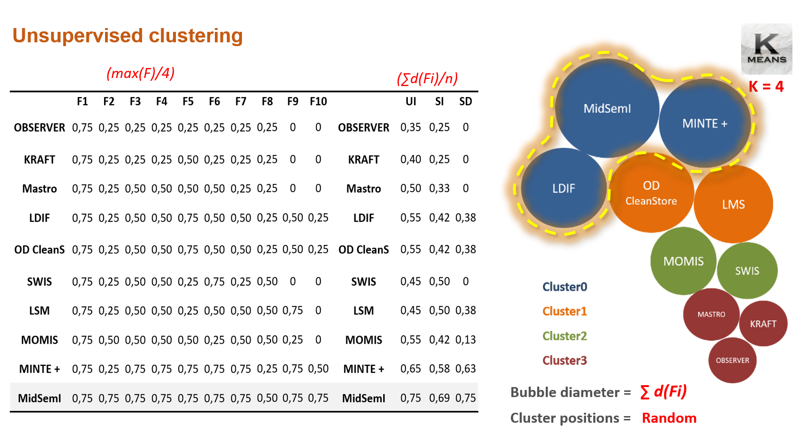
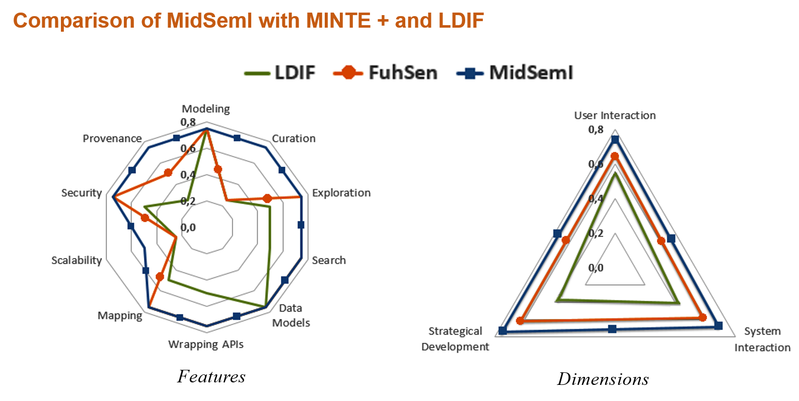

# K-Means Clustering

This is an unsupervised cluster analysis for identifying groups of approaches most similar in functionality to MidSemI. We evaluated the integration systems in related works section against the assessment presented in Table 3. 
 
The results are summarized in Table 4. In order to achieve this purpose, we transformed Table 4 into a matrix with numerical values that denote normalized distances (in the range [0-1]) among features, values close to 1 indicate proximity to the best implementation of this feature or dimension. We calculated distances related to dimensions by summing distances of all the features belongs to given dimension divided by their number. Figure 14 (a) reports the distances values for both features and dimensions. 
 
We employed *Weka* [https://www.cs.waikato.ac.nz/ml/weka/] which is a well-known machine learning analysis tool to perform the clustering. We applied the K-Means clustering algorithm with K=4. By clustering ten systems to four clusters, we aim at identifying a medium groups of systems which share similar function and to reveal dependencies encoded in the vector representation. Figure 14 (b) depicts the clustering results. The first cluster includes MidSemI along with FuhSen and LDIF systems. The second cluster contains OD CleanStore and LSM tools. The Third cluster holds MOMIS and SWIS systems. The rest of systems Mastro, KRAFT and OBSERVER form the last cluster. We generated the positions of clusters randomly, and the radius of each bubble is proportional to the sum of features distances for each system. 
 
Figure 15 (a) and (b) plots comparison of features and dimensions coverage respectively concerning only the first cluster that holds systems closest to our MidSemI approach (FuhSen and LDIF).
